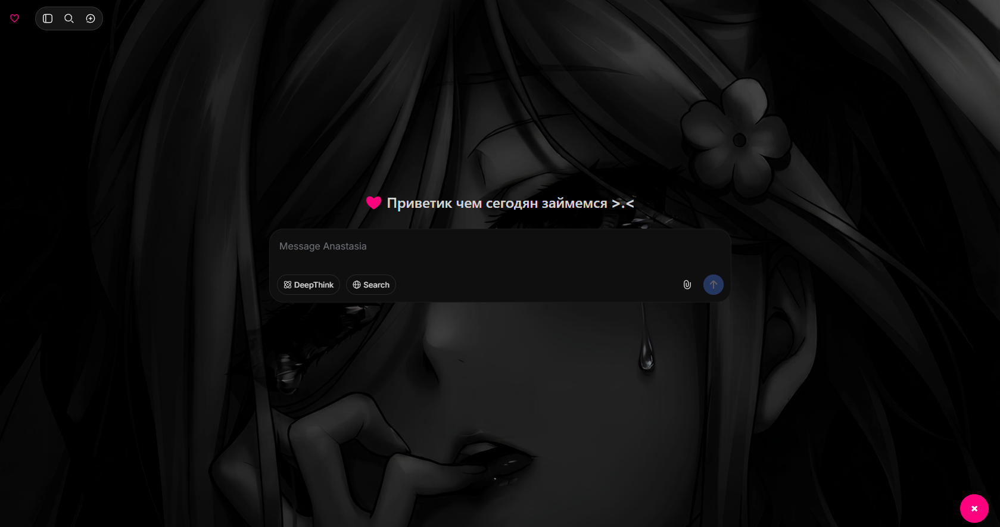

# Anastasia ♡

Расширение для Google Chrome

## Установка

Откройте [install.html](install.html) в браузере и следуйте инструкциям.

### Вручную
1. Скачайте архив или склонируйте репозиторий
2. Откройте `chrome://extensions`
3. Включите **Режим разработчика**
4. Нажмите **Загрузить распакованное расширение**
5. Выберите папку `Anastasia`

## Использование

1. Откройте [chat.deepseek.com](https://chat.deepseek.com)
2. Нажмите кнопку **A** в правом нижнем углу
3. Anastasia готова ♡

Промт немного дает буста в рассуждение и понимании задач

PS: нет деняг на API))) так что вот так воооот..

## Файлы

| Файл | Описание |
|------|----------|
| `content.js` | Ребрендинг интерфейса |
| `interceptor.js` | Подмена промпта |
| `style.css` | Стили расширения |
| `manifest.json` | Конфигурация расширения |
| `icon.png` | Иконка расширения |
